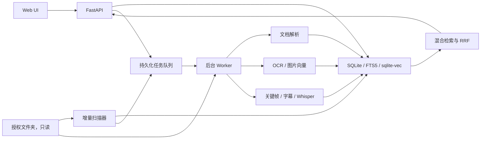

# AI NAS Search 项目开发与 TOS 7 上架指南

> 文档状态：项目开发基线  
> 目标平台：TOS 7.0+，首发 `x86_64`  
> 目标设备：12 线程 Intel Alder Lake、16 GB 内存、Intel 核显  
> 应用类型：Docker 应用  
> 参考基线：[TOS 7 应用开发与上架指南，提交 bd923306](https://github.com/jwlv-1314/test2026/commit/bd9233065d3d3242dd8b7953eded499a7fc365da)

## 0. 文档用途与重要声明

本文档是项目需求、架构、AI 协作规则、实现顺序、测试标准和 TOS 7 上架准备的统一
依据。开发者和 AI 在修改代码前都应先阅读本文档。

参考提交中的指南标记为 TOS 7.0 Beta，部分开发者平台能力仍标记为“即将上线”。
本文档把该指南作为当前设计基线，但不能承诺仅凭本文档一定通过审核。正式提交前必须
重新下载当时的官方模板、核对最新字段和审核要求，并在真实 TNAS 上完成全生命周期测试。

本项目暂定以下发布标识：

| 项目 | 暂定值 | 发布前动作 |
|---|---|---|
| 产品名 | AI NAS Search | 确认商标和中英文展示名 |
| 应用 ID | `ainas-search` | 在开发者平台检查全局唯一性；首次发布后不可更改 |
| 容器名 | `ainas-search` | 必须与最终应用 ID 一致 |
| 默认端口 | `18680` | 在目标 TNAS 检查占用 |
| 发布者 | `<publisher>` | 替换为开发者认证账号名称 |
| Docker Hub 镜像 | `<dockerhub-user>/ainas-search` | 替换并公开镜像与说明 |
| 首发版本 | `1.0.0` | 与所有发布元数据保持一致 |

任何 AI 都不得自行决定最终应用 ID、发布者身份、Docker Hub 组织、许可证变更或执行
实际上架操作。

## 1. 产品目标

AI NAS Search 是运行在 TNAS 内部的个人文件检索应用。它读取用户明确授权的一个或
多个文件夹，建立本地索引，并提供：

- 文件夹树和分页文件列表；
- 文件名、路径、类型、大小、日期等元数据搜索；
- PDF、Office、文本和代码的全文与语义搜索；
- 图片 OCR、文搜图和相似图片搜索；
- 视频关键帧搜索、字幕搜索和语音转写搜索；
- 文档页码、工作表、幻灯片、行号和视频时间点定位；
- 可暂停、恢复、限速和观察的后台索引任务。

### 1.1 非目标

首个稳定版本不实现：

- 修改、删除、移动、重命名或整理用户原文件；
- 多 NAS 节点和分布式索引；
- 默认连接云端 AI 服务；
- 通用聊天机器人或大模型问答；
- 自动解压并索引任意压缩包内容；
- 未经真实设备验证的 ARM64 上架包。

## 2. 不可破坏的产品约束

1. 用户文件卷必须以 `:ro` 挂载。
2. 所有衍生数据只能写入应用数据卷。
3. Web API 不接受任意宿主机路径，只接受数据库 ID 和受控相对路径。
4. 容器以非 root UID/GID 运行。
5. 不使用 `privileged`、`network_mode: host` 或 Docker Socket。
6. 不执行 Office 宏、脚本、压缩包程序或文件内嵌代码。
7. 不把文件内容、文件名、OCR、向量或遥测发送到外网。
8. 数据源短暂离线时，不得将全库文件误判为删除。
9. 索引可以重建，但配置、迁移记录和用户设置必须可靠持久化。
10. 后台 AI 任务不得阻塞 Web API。

## 3. TOS 应用类型决策

本项目选择 Docker 应用，而不是 Deb 应用，原因是：

- 依赖 Python 3.11、模型运行库、SQLite 扩展、OCR、FFmpeg 和图像库；
- 需要控制依赖版本并隔离宿主系统；
- 模型与解析器依赖不适合安装到 TOS 系统 Python；
- 需要明确的卷、资源限制和可复现构建；
- 符合参考指南的“复杂依赖使用 Docker”和容器优先方向。

TOS 宿主机上的 Python、Node.js 或其他运行时都不作为项目运行依赖。所有运行时和
第三方库必须在镜像构建阶段固定并打入镜像，禁止应用启动后执行 `apt install` 或
在线 `pip install`。

## 4. 系统架构



### 4.1 进程划分

推荐使用同一镜像启动两个服务：

- `ainas-api`：API、静态前端、轻量查询和管理操作；
- `ainas-worker`：扫描、解析、OCR、嵌入和视频任务。

两者共享本地应用数据卷。SQLite 使用 WAL 模式；Worker 是主要写入者，API 以读取为
主，只写设置和任务命令。不得引入 Redis 作为队列。

如果 TOS 应用模板对多服务支持不稳定，允许在首个 MVP 中使用单容器监督两个子进程，
但模块边界和健康检查仍需独立。

## 5. 技术栈

| 范围 | 选型 | 说明 |
|---|---|---|
| 后端 | Python 3.11、FastAPI、Pydantic | API 与业务编排 |
| 前端 | TypeScript、React 或 Vue | 构建为静态资源 |
| 数据库 | SQLite | 单机源数据与配置 |
| 全文检索 | SQLite FTS5 | 文件名、路径、正文、OCR、字幕 |
| 向量检索 | sqlite-vec | 首发内嵌方案 |
| PDF | PyMuPDF | 文本块、页码、渲染 |
| Office | python-docx、python-pptx、openpyxl | 新版 Office 格式 |
| OCR | PaddleOCR 轻量模型 | 中文与英文 OCR |
| 文本向量 | `BAAI/bge-small-zh-v1.5` | 24M 参数、512 维、中文检索 |
| 视觉向量 | Chinese-CLIP RN50 | 中文文搜图 |
| 视频 | FFmpeg、FFprobe | 元数据、抽帧、字幕和音轨 |
| 语音 | faster-whisper base/small INT8 | CPU 本地转写 |
| 推理 | ONNX Runtime/OpenVINO/CTranslate2 | CPU 优先，核显可选 |
| 构建 | Docker Buildx | 首发 amd64，后续再验证 arm64 |

生产依赖必须固定版本并生成依赖清单。`sqlite-vec`仍是 pre-v1 组件，其表结构和调用
必须封装在 repository 层，避免业务代码依赖扩展细节。

## 6. 仓库目录规划

```text
nas-tool/
├── AGENTS.md
├── README.md
├── LICENSE
├── config.ini
├── app.lang
├── docker-compose.yml
├── .env.example
├── Dockerfile
├── images/icons/ainas-search.svg
├── backend/
│   ├── pyproject.toml
│   ├── src/ainas/
│   │   ├── api/
│   │   ├── config/
│   │   ├── db/
│   │   ├── scanner/
│   │   ├── extractors/
│   │   ├── embeddings/
│   │   ├── search/
│   │   ├── jobs/
│   │   └── security/
│   ├── migrations/
│   └── tests/
├── frontend/
├── scripts/
├── docs/
└── .github/workflows/
```

所有 Linux 脚本、YAML、JSON、Python、配置和语言文件必须使用 LF 换行。仓库应增加
`.gitattributes`，对相关文件强制 `eol=lf`。

## 7. 数据目录与挂载

目标 TNAS 当前可用数据盘是 `/Volume1`。建议：

```text
/Volume1/docker/ainas-search/
├── config/
├── index/
├── models/
├── thumbnails/
├── cache/
├── temp/
├── backups/
└── logs/
```

用户数据源不能硬编码为整个 `/Volume1`。安装时由用户选择一个明确目录，例如
`/home/<username>`或`/Volume1/<authorized-share>`。

建议通过 `.env` 参数化：

```dotenv
AI_NAS_SOURCE_PATH=/Volume1/AI-NAS-Media
AI_NAS_DATA_PATH=/Volume1/docker/ainas-search
AI_NAS_HTTP_PORT=18680
AI_NAS_PUID=1000
AI_NAS_PGID=1000
AI_NAS_CPU_LIMIT=2.0
AI_NAS_MEMORY_LIMIT=2G
TZ=Asia/Shanghai
```

发布前必须确认 TOS 官方 Docker 模板如何在安装界面收集和替换这些参数。如果平台
不支持交互变量，首发包应使用平台允许的共享文件夹约定，而不是挂载整个数据卷。

`/home`和`/Volume1`可能指向同一 Btrfs 逻辑卷。用户不能同时把同一内容的两个入口
加入扫描。数据库还应使用设备号、inode和快速指纹进行重复检测。

## 8. 数据模型

| 表 | 作用 |
|---|---|
| `roots` | 授权数据源、扫描策略和健康状态 |
| `entries` | 用户看到的目录项和相对路径 |
| `objects` | 实际文件内容、指纹和处理状态 |
| `entry_objects` | 路径与内容对象关联，处理硬链接/重复文件 |
| `chunks` | 文档、OCR、字幕和转写文本块 |
| `frames` | 视频关键帧和时间点 |
| `jobs` | 可恢复后台任务 |
| `scan_runs` | 扫描代次和完成状态 |
| `settings` | 应用设置 |
| `schema_migrations` | 数据库迁移记录 |
| `extractor_versions` | 解析器和模型版本 |

全文索引分为文件名/路径和正文。中文文件名优先使用 FTS5 trigram；正文存储原文与
分词检索字段。文本向量和视觉向量必须使用不同的 sqlite-vec 表，不能跨模型比较。

每个衍生结果记录解析器、模型、版本、源指纹和创建时间。模型升级时建立新版本索引，
完成后原子切换，不在同一向量表中混合新旧模型。

## 9. 文件扫描设计

### 9.1 全量扫描

1. 校验根目录存在、可读且与配置一致。
2. 创建新的 `scan_generation`。
3. 使用 `scandir` 流式遍历，不一次加载全部路径。
4. 批量写入元数据并为变化文件创建任务。
5. 周期性保存检查点。
6. 只有根目录健康且整次扫描成功时，才把未出现的旧条目标记为缺失。
7. 缺失条目经过至少一次后续确认后再变为 tombstone。

这可以避免共享目录临时离线时删除整库索引。

### 9.2 增量识别

第一层使用相对路径、文件大小和纳秒修改时间。变化时计算快速指纹：大小、前64 KiB
哈希和后64 KiB哈希。完整SHA-256只用于强去重或显式校验，避免每次读取大型视频。

解析前后再次`stat`。若文件在处理期间变化，丢弃结果并延迟重试。默认不跟随符号
链接、不跨挂载点，并排除回收站、快照、缓存、应用数据目录和常见依赖目录。

### 9.3 监听策略

文件事件仅作为加速信号，不作为唯一事实来源：

- 文件事件进入去抖队列；
- 每5至15分钟执行轻量一致性扫描；
- 每天低负载时执行完整校验；
- SMB写入、批量移动和错过事件由一致性扫描修复。

## 10. 内容提取

### 10.1 文本、PDF和Office

- 文本检测编码、保留行号、限制最大索引字节数；
- PDF逐页提取文本块，低文本密度页面才执行OCR；
- DOCX提取标题、段落和表格；
- PPTX保留幻灯片和备注；
- XLSX保留工作表和单元格显示值；
- 宏永不执行，外部链接永不访问；
- 旧格式转换器必须在受限子进程运行。

### 10.2 图片

- 应用EXIF方向并生成受配额管理的WebP缩略图；
- 提取尺寸和拍摄时间；
- 计算感知哈希、OCR和视觉向量；
- GPS只存本地，默认不显示精确坐标且不写日志；
- 防御损坏图像、超大像素图和解压炸弹。

### 10.3 视频

- FFprobe提取时长、分辨率、编码、音轨和字幕轨；
- 优先索引内嵌字幕和同名SRT/VTT；
- 固定间隔与镜头变化组合抽帧；
- 相邻相似帧用感知哈希去重；
- 只保存小型关键帧预览；
- 无字幕时使用faster-whisper CPU INT8；
- 字幕、转写和关键帧保留毫秒时间戳。

所有解析器必须具有文件大小限制、执行超时、临时目录配额和错误隔离。压缩包首发仅
索引文件名和目录清单，不递归展开内容。

## 11. 搜索设计

一次查询并行获取文件名/路径FTS、正文/OCR/字幕FTS、文本向量和视觉向量候选，每路
默认Top 200。文件类型、目录、日期、大小和权限是硬过滤条件。

候选使用RRF融合，初始参数`k=60`，再对文件名完全匹配、短语匹配和指定目录命中做
有限加权。文档相邻块和视频相邻时间点需要合并；单文件最多显示三个命中片段。

结果必须解释命中原因：文件名、正文、语义、OCR、图片画面、字幕或语音。第一版自然
语言过滤使用规则解析，不调用大模型。

## 12. API 基线

```text
GET    /api/v1/health
GET    /api/v1/system
GET    /api/v1/roots
POST   /api/v1/roots/{id}/scan
POST   /api/v1/roots/{id}/pause
GET    /api/v1/entries
GET    /api/v1/entries/{id}
GET    /api/v1/entries/{id}/thumbnail
GET    /api/v1/entries/{id}/preview
GET    /api/v1/search
POST   /api/v1/search/by-image
GET    /api/v1/jobs
POST   /api/v1/jobs/{id}/retry
POST   /api/v1/jobs/{id}/cancel
GET    /api/v1/stats
```

目录列表和搜索使用游标分页。预览接口仅接受条目ID，解析数据库根目录和相对路径后
再次执行canonical containment检查。视频预览支持HTTP Range。

## 13. 后台任务

任务状态：

```text
queued -> running -> completed
                  -> retry -> running
                  -> failed
                  -> cancelled
```

Worker领取任务时写入`lease_owner`和`lease_until`。容器崩溃后租约过期，任务可以
重新领取。每个任务必须幂等；结果先写临时文件或临时表，完成后原子切换。

任务优先级：交互预览、新文件元数据、小文档、图片、OCR、视频字幕/转写、视频关键帧、
全库模型重建。默认只运行一个重型AI任务，并保证同一时刻只加载一个大型模型。

## 14. 安全与隐私

### 14.1 容器安全

- 非root用户；
- `cap_drop: [ALL]`；
- `security_opt: [no-new-privileges:true]`；
- 不使用特权模式、宿主网络或Docker Socket；
- 源文件夹只读；
- 应用根文件系统尽可能只读；
- 临时目录使用受限卷或tmpfs；
- 仅确认核显支持后映射`/dev/dri`。

### 14.2 Web和解析安全

- 使用TOS反向代理或HTTPS；
- Session Cookie使用`HttpOnly`、`Secure`和`SameSite`；
- 密码使用Argon2id，状态修改接口执行CSRF保护；
- 不在LocalStorage保存长期认证令牌；
- 未知文件作为附件下载，不以内联HTML执行；
- 文件被视为敌对输入，禁止宏、脚本和嵌入程序；
- 限制归档展开比例、递归层级和总大小；
- 转换器使用超时、内存和进程限制；
- 日志不记录正文、精确GPS、凭据和完整私有路径。

### 14.3 供应链与隐私

- 生产镜像使用多阶段构建，不包含编译器和测试工具；
- Python和前端依赖使用锁文件；
- 发布镜像固定版本，审核包优先固定到digest；
- 发布前生成SBOM并运行Trivy；
- 检查模型和依赖许可证，排除未确认商业许可的模型；
- 默认不发送遥测；
- 模型就绪后，核心浏览和搜索应支持离线运行；
- 未来云端能力必须明确选择并展示将上传的内容。

## 15. 资源与性能

为满足应用中心默认审核预期，首发使用节能配置：

```text
CPU limit: 2.0
Memory limit: 2 GiB
Heavy worker concurrency: 1
Whisper model: base INT8
Video indexing: scheduled / low priority
```

针对当前16GB设备，可选择增强配置：

```text
CPU limit: 4.0 to 8.0
Memory limit: 4 to 6 GiB
Heavy worker concurrency: still 1
Whisper model: small INT8
```

应用必须优雅降级：模型加载失败时记录任务错误并继续提供文件浏览和全文搜索。
Intel核显仅为可选加速；VAAPI/OpenVINO失败时自动回退CPU。

缓存和索引建议总配额40GB。磁盘空间低于安全阈值时停止生成新缓存和视频关键帧，
但不得损坏现有数据库。

SQLite建议启用WAL、外键、busy timeout和批量事务。数据库必须位于本地Btrfs数据卷，
不得放在SMB/NFS挂载中。定期执行WAL checkpoint、完整性检查和配置备份。

## 16. Docker Compose 发布要求

开发期Compose可以包含源码挂载和调试参数；上架包必须使用独立发布文件，不得包含
开发服务器、宿主源码挂载或明文密钥。

发布Compose基线：

```yaml
version: "3.8"

services:
  ainas-search:
    image: <dockerhub-user>/ainas-search:1.0.0
    container_name: ainas-search
    restart: unless-stopped
    user: "${AI_NAS_PUID:-1000}:${AI_NAS_PGID:-1000}"
    ports:
      - "${AI_NAS_HTTP_PORT:-18680}:8080"
    environment:
      TZ: "${TZ:-Asia/Shanghai}"
      AI_NAS_DATA_DIR: /app/data
      AI_NAS_SOURCE_DIR: /source
      AI_NAS_WORKERS: "1"
    volumes:
      - "${AI_NAS_SOURCE_PATH}:/source:ro"
      - "${AI_NAS_DATA_PATH}:/app/data:rw"
    cap_drop:
      - ALL
    security_opt:
      - no-new-privileges:true
    healthcheck:
      test: ["CMD", "python", "-m", "ainas.healthcheck"]
      interval: 30s
      timeout: 10s
      retries: 3
      start_period: 60s
    deploy:
      resources:
        limits:
          cpus: "${AI_NAS_CPU_LIMIT:-2.0}"
          memory: "${AI_NAS_MEMORY_LIMIT:-2G}"
```

发布前根据最新官方模板确认是否允许Compose变量和`deploy.resources`。若不允许，构建
脚本必须从模板生成不含未替换变量的最终提交文件。

不得使用端口22、80、443、8181或5050。不得使用`:latest`。镜像必须位于Docker Hub，
并保持公开、可拉取、文档完整。参考指南明确将其他镜像仓库列为驳回原因。

## 17. TOS 应用元数据

### 17.1 `config.ini`

尽管扩展名为`.ini`，参考指南要求它是无注释、无尾随逗号的合法JSON。首发草案：

```json
{
  "id": "ainas-search",
  "icon": "/images/icons/ainas-search.svg",
  "publisher": "<publisher>",
  "path": "http://${ip}:18680",
  "exec": true,
  "open_path": true,
  "resize": true,
  "maxmin": true,
  "width": 0,
  "height": 0,
  "help": "https://github.com/<owner>/nas-tool/blob/main/README.md",
  "version": "1.0.0",
  "recommend": false,
  "beta": true,
  "low_version": "TOS7.0",
  "category": ["Utilities"],
  "depend": ["DockerEngine"],
  "relation": [],
  "platform": "x86_64",
  "official": "https://github.com/<owner>/nas-tool",
  "application_type": "docker",
  "system_id": "",
  "package": "",
  "user": "ainas-search",
  "all_user_display": true
}
```

发布前必须替换所有尖括号占位符，并使用当时官方模板确认字段。版本号只使用数字和点；
测试版本使用`beta: true`，不要在版本号中添加`-beta`。

### 17.2 `app.lang`和图标

必须包含以下14个非空语言节点：

```text
zh-cn zh-hk en-us fr-fr de-de it-it es-es hu-hu
ja-jp ko-kr pl-pl ru-ru tr-tr pt-pt
```

至少人工校对简体中文、繁体中文和英文，其他语言无法可靠翻译时按参考指南使用英文。
名称、简介、描述和版本必须与实际功能、隐私行为和硬件要求一致。

图标必须是`images/icons/ainas-search.svg`，包含`viewBox`，不引用外部字体、脚本、
网络图片或远程资源，大小写与`config.ini`完全一致。

## 18. CI/CD

### 18.1 Pull Request检查

每次PR至少执行：

1. Python格式、lint、类型检查和测试；
2. 前端lint、类型检查、测试和构建；
3. 数据库全新安装与升级迁移测试；
4. `config.ini` JSON及必填字段校验；
5. `app.lang` 14语言校验；
6. SVG结构与路径校验；
7. Compose配置展开和语法校验；
8. LF换行校验；
9. Docker镜像构建；
10. 容器健康检查和最小烟雾测试。

### 18.2 发布流水线

标签`v1.0.0`触发：

1. 校验标签、`config.ini`和`app.lang`版本一致；
2. 构建`linux/amd64`镜像；
3. 运行单元、集成和容器烟雾测试；
4. 生成SBOM并执行Trivy扫描；
5. 推送Docker Hub固定版本标签；
6. 获取并记录镜像digest；
7. 从模板渲染最终上架Compose；
8. 确认无占位符、无`:latest`、无密钥；
9. 生成提交文件SHA-256；
10. 创建GitHub/Gitee Release并附变更说明和校验和。

CI Secrets只保存`DOCKERHUB_USERNAME`和`DOCKERHUB_TOKEN`等必要凭据，不得把密码、
Token或签名密钥写入工作流、镜像或Compose。

## 19. 测试策略

### 19.1 自动化测试

- 路径规范化和containment；
- 中文分词、查询解析和RRF；
- 文件指纹、改名和重复检测；
- 分块、页码、行号和时间戳；
- 任务租约、重试和幂等性；
- 配额和缓存清理；
- 权限、认证和输入验证。

集成测试数据集包括中文和特殊文件名、空目录、无权限目录、符号链接循环、硬链接、
损坏文件、文本PDF、扫描PDF、DOCX/PPTX/XLSX、超大文本、图片、无音轨视频、带字幕
视频、加密文件，以及处理期间持续写入的文件。测试样本只能使用自有或许可清晰内容。

### 19.2 故障恢复

- 扫描中终止容器；
- OCR和视频任务中终止Worker；
- 临时移除源目录；
- SQLite繁忙和磁盘空间不足；
- 模型文件损坏；
- 重启后验证任务恢复、无重复向量、无全库误删除。

### 19.3 真实TNAS验收

```text
安装 -> 启动 -> 健康 -> 添加数据 -> 扫描 -> 搜索
-> 停止 -> 启动 -> 数据仍在
-> 升级 -> 数据与配置仍在
-> 卸载但保留数据 -> 重装恢复
-> 完全卸载 -> 仅删除应用数据，不触及源文件
```

还要检查端口冲突、非root身份、资源上限、日志轮转、核显缺失时CPU回退和源目录
只读性。

## 20. 开发里程碑与AI任务边界

### M0：工程骨架

交付后端/前端目录、测试框架、迁移、Docker构建、健康检查和CI。验收容器非root、
健康检查正常、数据卷持久化、源卷只读。

### M1：文件浏览和扫描

交付数据源、全量/增量扫描、目录树、分页文件列表、任务状态和恢复。验收扫描中断可
恢复、源目录离线不会删除全库索引、API不能越出根目录。

### M2：全文和文本语义

交付文本/PDF/Office解析、中文FTS、BGE嵌入、RRF搜索和定位。验收PDF返回页码，
模型升级可并行重建。

### M3：图片

交付缩略图、EXIF、OCR、Chinese-CLIP、文搜图和相似图片。验收超大或损坏图像不能
拖垮Worker。

### M4：视频

交付FFprobe、关键帧、字幕、faster-whisper和时间点搜索。验收无核显时可回退，任务
暂停/重启后恢复，不永久保存完整抽帧。

### M5：TOS发布候选

交付正式元数据、14语言、SVG、发布Compose、Docker Hub镜像、SBOM、SHA-256、公开
README和TNAS测试报告。验收通过第22节全部门禁。

### AI每次任务模板

```text
目标里程碑：M?
具体目标：
允许修改的目录：
禁止修改的内容：
输入/输出契约：
必须覆盖的失败场景：
必须运行的测试：
完成定义：
```

AI应先检查现有实现和测试，只实现当前任务。完成时说明变更文件、测试结果、已知限制
和下一步，不能把未测试功能标记为完成。

## 21. 上架应用中心流程

1. 注册并验证TNAS开发者账号；
2. 确定全局唯一应用ID和发布者名称；
3. 从当时官方开发者平台下载最新Docker应用模板；
4. 将本项目发布文件与官方模板逐字段对照；
5. 建立长期可用的公开GitHub或Gitee仓库；
6. 将公开镜像发布到Docker Hub；
7. 创建固定版本Release，附完整资源和SHA-256；
8. 在开发者平台创建Docker类型应用；
9. 新增版本，版本必须与全部元数据一致；
10. 通过自动格式、字段、语言、SVG、版本和哈希校验；
11. 接受安全、功能、兼容性、合规和文档人工审核；
12. 对驳回项修复并使用更高版本号重新提交；
13. 审核通过后等待应用中心发布；
14. 长期保留公开仓库、镜像、Release和校验文件。

需要准备的仓库根文件：

```text
config.ini
app.lang
docker-compose.yml
.env.example
README.md
images/icons/ainas-search.svg
SHA-256 校验文件
```

README必须说明功能、最低与推荐硬件、源数据只读、数据位置、端口、网络访问、权限、
备份恢复、卸载行为、隐私、模型许可证、已知限制和故障排查。

## 22. 上架硬门禁

以下任一项失败，不得提交审核。

### 22.1 配置与资源

- [ ] 最终应用ID已确认唯一，所有位置完全一致；
- [ ] `config.ini`是无注释合法JSON，无占位符或尾随逗号；
- [ ] 版本严格大于历史版本，测试版使用`beta: true`；
- [ ] `app.lang`包含全部14种语言且字段非空；
- [ ] 功能描述与实际实现完全一致；
- [ ] SVG存在、路径一致、包含`viewBox`且无外部资源；
- [ ] 所有脚本和配置使用LF。

### 22.2 Docker

- [ ] Compose兼容3.8+；
- [ ] 镜像来自Docker Hub且公开可拉取；
- [ ] 镜像使用固定版本或digest，不使用`:latest`；
- [ ] 容器名与应用ID一致；
- [ ] 非root用户运行；
- [ ] 没有`privileged`、宿主网络或Docker Socket；
- [ ] 不占用22、80、443、8181、5050；
- [ ] 所有重要数据持久化到数据盘；
- [ ] 源目录以`:ro`挂载；
- [ ] 健康检查稳定；
- [ ] 停止、重建容器后数据仍存在。

### 22.3 安全与质量

- [ ] 镜像没有硬编码密码、Token、私钥或用户数据；
- [ ] Trivy没有未接受的HIGH/CRITICAL漏洞；
- [ ] SBOM和第三方许可证清单已生成；
- [ ] 路径遍历、SQL注入、XSS、CSRF和解析器超时测试通过；
- [ ] 日志不包含正文、凭据和敏感路径；
- [ ] 所有提交文件SHA-256与实际文件匹配；
- [ ] 维护仓库账号启用2FA；
- [ ] 仓库与镜像长期公开可用。

### 22.4 真实设备

- [ ] 在真实TOS 7 TNAS完成安装、启动、停止、重启、升级和卸载；
- [ ] 验证非root身份、资源限制和端口；
- [ ] 验证无核显或核显不可用时CPU回退；
- [ ] 验证目录离线不会误删索引；
- [ ] 验证应用不能修改源文件；
- [ ] 验证应用数据备份和恢复；
- [ ] 测试结果记录在发布附件中。

## 23. 常见审核风险及规避

| 风险 | 规避方式 |
|---|---|
| Docker Hub个人镜像缺少可信度 | 公开源码、完整README、固定版本、SBOM、digest、持续维护，发布者身份一致 |
| AI资源占用被认为过高 | 默认2CPU/2GB、单Worker、夜间视频任务，在README解释增强配置 |
| 挂载个人目录权限过宽 | 只挂载用户明确选择的目录且只读，不挂载整个卷 |
| 应用描述超出实现 | 每个版本只描述已完成并已测试功能 |
| 模型许可证不清楚 | 发布前生成许可证清单，排除未确认商业许可模型 |
| 依赖联网下载模型 | 模型在构建或受控首次配置阶段准备，审核时明确网络行为 |
| 镜像过大 | 多阶段构建、模型按功能分层、清理工具和缓存，记录实际大小 |
| 端口或路径大小写错误 | CI展开Compose并在真实TNAS验证，使用实际`/Volume1`路径 |
| 卸载误删用户文件 | 删除仅允许发生在已验证应用数据根目录，源目录永不参与清理 |
| 指南后续变化 | 提交前重新获取官方模板和规则，不依赖旧提交快照 |

## 24. 完成定义

项目达到首个可上架候选版本必须同时满足：

1. M0至M4范围与测试完成；
2. 所有产品不可破坏约束可被自动测试或人工验证；
3. 发布镜像可从Docker Hub在全新TNAS上安装；
4. 不访问互联网也能完成文件浏览和已安装模型搜索；
5. 容器重建、NAS重启和任务中断不丢失索引状态；
6. 用户源文件在任何操作下均未被修改；
7. 第22节上架硬门禁全部通过；
8. 最新TOS官方模板与提交包完成逐项核对；
9. 开发者确认应用ID、发布者、许可证、隐私声明和发布内容；
10. 由开发者在TNAS开发者平台手动发起最终提交。
